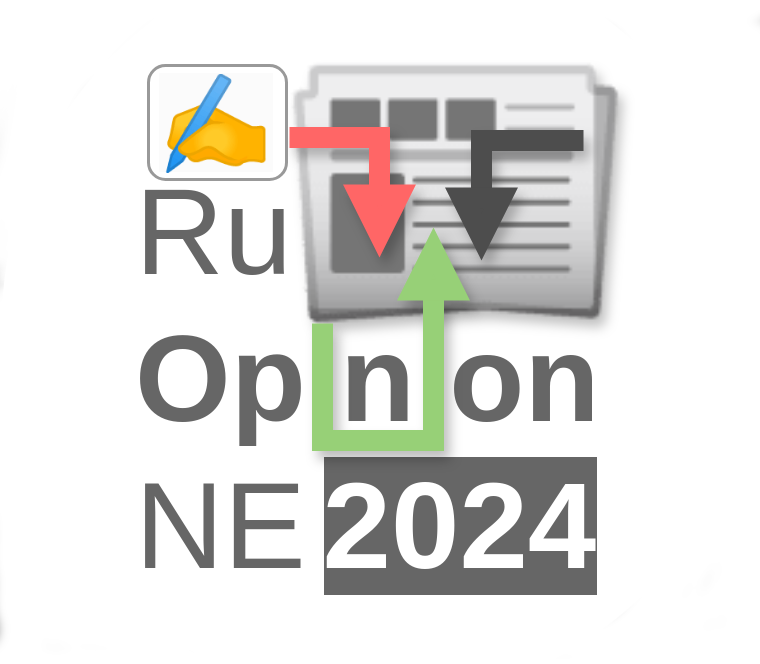
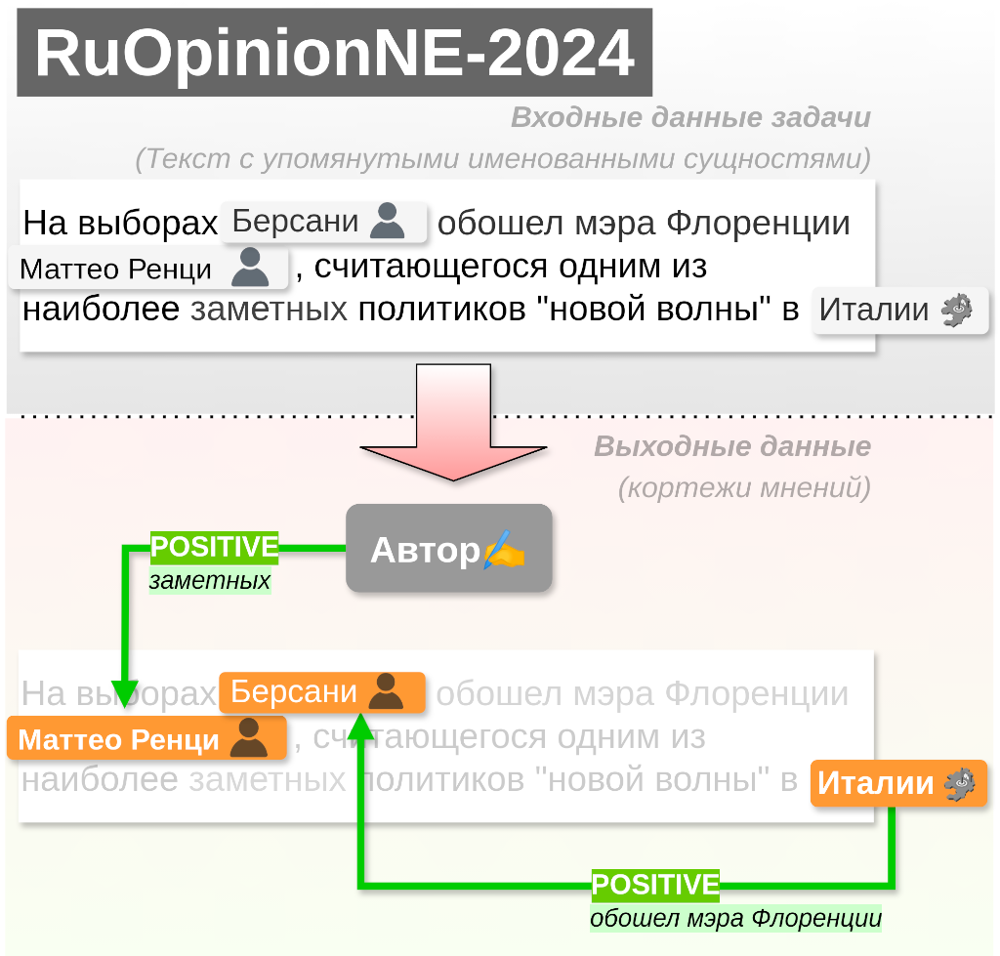

# RuOpinionNE-2024 -- соревнование по извлечению кортежей мнений из русскоязычных новостных текстов
 

    

### [Ссылка на соревнования в системе Codalab](https://codalab.lisn.upsaclay.fr/competitions/20244)

### [:alarm_clock: Даты и график проведения соревнования](https://codalab.lisn.upsaclay.fr/competitions/20244#learn_the_details-terms_and_conditions)

### [:chart_with_upwards_trend:  Таблица результатов](https://codalab.lisn.upsaclay.fr/competitions/20244#results)

### [:newspaper: Telegram канал соревнований](https://t.me/RuOpinionNE2024)

# Содержание

* [Краткое описание](#краткое-описание)
   * [**Кортеж мнения**](#кортеж-мнения)
   * [Пример](#пример)
* [Формат данных](#формат-данных)
    * [Пример чтения данных](#пример-чтения-данных)
* [Соревнования на Codalab](#соревнования-на-codalab)
    * [Базовый подход](#базовый-подход)
* [Организаторы](#организаторы)
* [Источники](#источники)
* [Ссылки](#ссылки)

# Краткое описание 

> ⚠️ **Внимание:** Полное описание представлено **[на платформе Codalab](https://codalab.lisn.upsaclay.fr/competitions/20244#learn_the_details-overview)**. 
> Настоящее описание несет ознакомительный характер.

**RuOpinionNE-2024** является продолжением тестирования [RuSentNE-2023](https://www.dialog-21.ru/evaluation/2023/rusentne/), 
в котором требовалось извлечение *тональности предложения по отношению к заданной именованной сущности*. 
Ключевые отличительные особенности постановки настоящей задачи приведены в формате указания *входной* и *выходной* информации.

    

> **Рисунок**: пример извлечения кортежей мнений соревнования RuOpinionNE-2024; 
> сущности входного текста **не являются параметрами задачи**, а лишь размечены визуально.

**Входная информация** включают в себя текст представляющий собой предложение из новостного текста с упомянутыми именованными сущностями. 

**Выходная информация** настоящих соревнований предполагает извлечение **кортежей мнений**.
В следующем подразделе рассмотрим более подробно формат представления кортежа мнений.

## Кортеж мнения

Для заданного текста, 
*кортеж мнения* представляет собой структуру, состоящую из последовательности четырех значений:
1. **источник мнения**: автор, именованная сущность текста (подстрока исходного текста), либо `пустой`;
2. **объект мнения**: именованная сущность в тексте (подстрока исходного текста);
3. **тональность**: положительная/негативная;
4. **языковое выражение**: аргумент, на основании которого принята результирующая тональность (одна или несколько подстрок исходного текста);

## Пример

> ⚠️ **Внимание:** Полное описание форматирования предложений представлено **[на платформе Codalab](https://codalab.lisn.upsaclay.fr/competitions/20244#learn_the_details-overview)**.
> Настоящее описание несет ознакомительный характер.

Для входного предложения и размеченных в нем <ins>именованных сущностей</ins>:
> Премьер-министр <ins>Италии</ins> <ins>Маттео Ренци</ins> заявил, что с уходом <ins>Фо</ins> «страна потеряла крупнейшую фигуру культурной жизни»

Должен быть порожден следующий [кортеж мнения](#кортеж-мнения):
> (Маттео Ренци, Фо, pos, крупнейшую фигуру культурной жизни)

# Данные соревнования 

Коллекция включает в себя набор следующих файлов:
* [`train.jsonl`](train.jsonl) -- обучающие данные.
* [`validation.jsonl`](validation.jsonl) -- данные валидационного этапа.
    * 🆕 [`validation_labeled.jsonl`](validation_labeled.jsonl) -- размеченные данные валидационного этапа.
* [`test.jsonl`](test.jsonl) -- данные финального тестирования.

Полное описание формата представлено **[на платформе Codalab](https://codalab.lisn.upsaclay.fr/competitions/20244#learn_the_details-overview)**.

# Соревнования на Codalab

### [Полное описание постановки задачи на платформе Codalab](https://codalab.lisn.upsaclay.fr/competitions/20244#learn_the_details-overview)

### [Скрипт оценки результатов](codalab/evaluation.py)

### [Пример посылки (Скрипт генерации случайной разметки)](tests/test_stress_eval.py)

## Базовый подход

См. описание в тексте статьи задачи.

## Result Analysis

To evaluate your submissions, you have to navigate to [analysis](./analysis) folder for the related scripts.

**Input**. All the submissions are expected to be placed in [submissions](./analysis/submissions) folder in `.zip` format. 

**Output**. Scripts are dedicated to produce `*.tsv` files suitable for uploading at spreadsheet.
The `analysis_pretty.py` merges all the prior composed files into a single `*.tsv`.

> **Tip:** you can zip labeled data to see the related annotation alongside with your. 

## Организаторы
* [Лукашевич Наталья Валентиновна](https://scholar.google.com/citations?user=FKkWXLkAAAAJ&hl=en) (МГУ им. М.В. Ломоносова)
* [Nicolay Rusnachenko](https://nicolay-r.github.io/) (Bournemouth University)
* [Лапаницына Анна Максимовна](https://github.com/ann-ari) (МГУ им. М.В. Ломоносова)
* [Ткаченко Наталья Максимовна](https://github.com/nm-tkachenko) (МГУ им. М.В. Ломоносова)

## Источники

[Официальная информация по конференции Dialogue-2025](https://www.dialog-21.ru/evaluation/2024/ruopinionne/)

[Репозиторий ранее проводимых соревнований RuSentNE-2023](https://github.com/dialogue-evaluation/RuSentNE-evaluation)

## Ссылки

> **TODO:** Paper Reference once issued.
